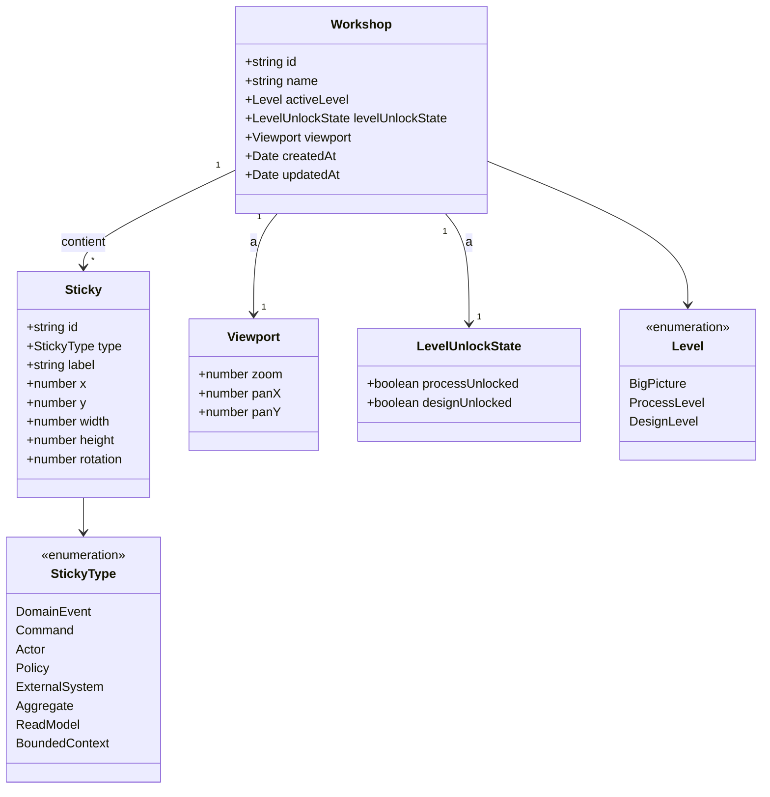
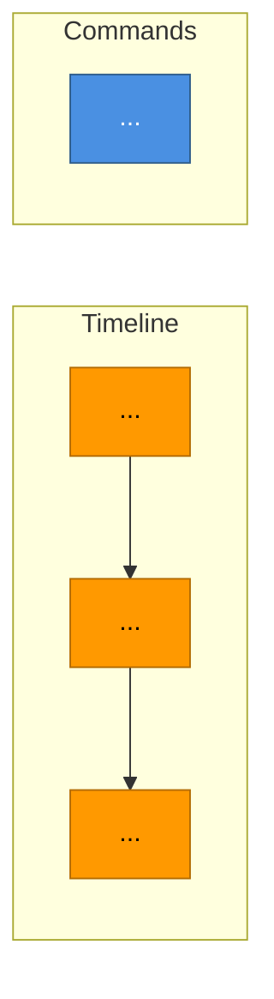

# EventStormer — Spécification fonctionnelle

> Version : 1.2 | Statut : Validé | Date : 2026-04-17

## Sommaire

- [1. Contexte et objectif](#1-contexte-et-objectif)
- [2. Utilisateurs cibles](#2-utilisateurs-cibles)
- [3. Périmètre fonctionnel](#3-périmètre-fonctionnel)
- [4. Cas d'usage principaux](#4-cas-dusage-principaux)
- [5. Règles métier](#5-règles-métier)
- [6. Modèle de domaine](#6-modèle-de-domaine)
- [7. Format d'export Markdown](#7-format-dexport-markdown)
- [8. Contenu pédagogique (tooltips)](#8-contenu-pédagogique-tooltips)
- [9. Direction visuelle](#9-direction-visuelle)
- [10. Contraintes techniques](#10-contraintes-techniques)
- [11. Hors périmètre](#11-hors-périmètre)
- [12. Critères de succès](#12-critères-de-succès)

---

## 1. Contexte et objectif

Les ateliers d'**Event Storming** (Alberto Brandolini) sont au cœur des démarches DDD pour modéliser un domaine métier avec les experts. Les outils actuels sont soit généralistes et payants (Miro, Mural), soit inexistants en version dédiée open-source.

**EventStormer** est un outil web léger, 100 % frontend, conçu pour être **projeté par un animateur** pendant un atelier DDD en présentiel. Visuellement inspiré de Figma, Linear et Excalidraw : canvas plein écran, chrome UI réduit au minimum, palette flottante, interactions directes.

**Problème résolu** : disposer d'un canevas numérique épuré et agréable, respectant le vocabulaire DDD, avec un accompagnement léger pour l'animateur (tooltips explicatifs, progression naturelle des niveaux), sans compte ni backend, avec un export Markdown + Mermaid pour la documentation.

## 2. Utilisateurs cibles

**Projet mono-utilisateur** : un animateur pilote l'outil pendant l'atelier.

Profil type :
- Développeur, architecte ou coach qui **anime** un atelier DDD pour son équipe
- Connaît le vocabulaire event storming
- Utilise l'outil en mode projection (vidéoprojecteur ou grand écran partagé), ou en solo pour préparer un atelier

**Pas d'utilisateur final "équipe débutante"** : l'équipe n'interagit pas avec l'outil, elle discute autour.

**Taille type d'un workshop** : 30 à 150 stickies.

## 3. Périmètre fonctionnel

### 3.1 Canvas interactif
- Canvas **plein écran** par défaut occupant tout le viewport
- Pan et zoom (molette, pinch, raccourcis clavier)
- Ajout de **sticky notes** par drag & drop depuis le dock
- Déplacement libre des stickies sur le canvas
- Édition inline du texte d'un sticky
- Suppression par sélection + `Suppr` ou bouton contextuel
- **Mode plein écran navigateur** via `F`

### 3.2 Les 3 niveaux d'Event Storming avec progression naturelle
- **Big Picture** : `DomainEvent` uniquement (orange). Actif par défaut.
- **Process Level** (verrouillé initialement) : débloqué par action explicite. Active `Command`, `Actor`, `Policy`, `ExternalSystem`.
- **Design Level** (verrouillé initialement) : débloqué après Process Level. Active `Aggregate`, `ReadModel`, `BoundedContext`.
- Déblocage unidirectionnel, bascule libre entre niveaux débloqués, non-destructive.
- **Intention** : nudge pédagogique, pas gating technique.

### 3.3 Accompagnement pédagogique
- **Tooltip riche au survol** de chaque sticky dans le dock (définition + exemple + astuce)
- Style popover custom via CDK Overlay, pas matTooltip natif
- Accessible au focus clavier
- Voir §8 pour le contenu complet

### 3.4 Gestion du workshop
- Un seul workshop actif, persisté en IndexedDB
- Bouton « Nouveau workshop » avec garde-fou export `.json` préalable obligatoire
- Nom éditable inline en haut-gauche du canvas
- Auto-save debounced 500 ms

### 3.5 Dock palette
- **Dock flottant en bas du canvas**, style dock macOS
- Contient les stickies disponibles selon niveau actif + niveaux débloqués
- Items verrouillés affichés en grisé avec icône cadenas
- Comportement : pinned par défaut, auto-hide disponible en option
- Boutons d'action secondaires (export, nouveau, import, plein écran) regroupés en bas-droite du canvas, séparément du dock

### 3.6 Raccourcis clavier
- `Espace` (maintenu) + drag = pan
- `Ctrl+molette` = zoom (alternative molette seule)
- `F` = toggle plein écran
- `Suppr` = supprimer sticky sélectionné
- `Échap` = désélectionner / sortir édition inline
- `Ctrl+E` = export Markdown
- `Ctrl+N` = nouveau workshop (déclenche garde-fou)
- `D` = toggle dock (replier/déplier)

### 3.7 Export
- **Export Markdown** structuré avec Mermaid en tête (voir §7)
- **Export JSON** snapshot complet

### 3.8 Import
- **Import JSON** avec validation de schéma et confirmation

## 4. Cas d'usage principaux

### UC-01 — Démarrer un nouveau workshop
- **Acteur** : animateur
- **Déclencheur** : premier lancement, ou clic « Nouveau workshop » / `Ctrl+N`
- **Préconditions** : aucune au premier lancement ; workshop existant sinon
- **Scénario nominal** :
  1. Si workshop existe, export `.json` obligatoire via dialog
  2. Workshop réinitialisé après export
  3. Saisie du nom de workshop
  4. Canvas en Big Picture, niveaux supérieurs verrouillés
- **Variantes** : annulation export → workshop conservé

### UC-02 — Poser un Domain Event
- **Acteur** : animateur
- **Déclencheur** : drag d'un sticky « Event » depuis le dock vers le canvas
- **Scénario nominal** :
  1. Drag depuis le dock (tooltip visible au survol pour rappel)
  2. Drop à position `(x, y)` sur canvas
  3. Sticky apparaît avec placeholder, focus automatique
  4. Saisie du libellé
  5. Persistance IndexedDB
- **Variantes** : libellé vide → marqué incomplet visuellement

### UC-03 — Débloquer le Process Level
- **Acteur** : animateur
- **Déclencheur** : clic sur bouton dédié dans le dock ou barre d'actions
- **Scénario nominal** :
  1. Dialog de confirmation explicative
  2. Validation → palette enrichie, niveau actif = Process
  3. Events existants conservés
  4. État persisté

### UC-04 — Débloquer le Design Level
Similaire à UC-03. Active Aggregates, Read Models, Bounded Contexts. Accessible uniquement si Process débloqué.

### UC-05 — Basculer entre niveaux débloqués
- Sélecteur intégré au dock ou barre flottante
- Tous les stickies restent visibles quel que soit le niveau

### UC-06 — Exporter en Markdown
- `Ctrl+E` ou bouton barre d'actions
- Génération Mermaid + détail textuel
- Téléchargement `<nom>-<YYYYMMDD>.md`
- Workshop vide → export refusé avec message

### UC-07 — Importer un workshop `.json`
- Bouton barre d'actions + file picker
- Validation schéma, confirmation, remplacement atomique

### UC-08 — Naviguer dans le canvas
- Pan : `Espace + drag`
- Zoom : molette ou `Ctrl+molette`
- Bornes 25 %-300 %

### UC-09 — Mode plein écran
- `F` ou bouton dédié
- Utilise l'API Fullscreen navigateur
- Retour via `Échap` ou `F`

### UC-10 — Replier/déplier le dock
- `D` ou clic sur une poignée visible
- Animation fluide
- Canvas accessible sur toute la hauteur quand replié

## 5. Règles métier

- **RM01** — Un workshop contient exactement zéro ou un canvas.
- **RM02** — Un sticky appartient à un seul type parmi : `DomainEvent`, `Command`, `Actor`, `Policy`, `ExternalSystem`, `Aggregate`, `ReadModel`, `BoundedContext`.
- **RM03** — Les stickies disponibles dans le dock dépendent du niveau actif et des niveaux débloqués. Changer de niveau ne supprime jamais de stickies existants.
- **RM04** — Un sticky a obligatoirement une position `(x, y)` en coordonnées canvas.
- **RM05** — Le libellé peut être vide (placeholder affiché).
- **RM06** — Un `BoundedContext` est un conteneur visuel : détection géométrique à l'export, pas de lien persisté.
- **RM07** — L'export Markdown trie les `DomainEvent` par X croissant.
- **RM08** — Toute mutation déclenche sauvegarde IndexedDB (debounce 500 ms).
- **RM09** — Création d'un nouveau workshop impossible sans export préalable si workshop existe.
- **RM10** — Zoom borné 25 %-300 %.
- **RM11** — Format JSON versionné (`schemaVersion`).
- **RM12** — Dans le Mermaid exporté, seuls les `DomainEvent` sont reliés entre eux par flèches. Autres types en `subgraph` sans relations.
- **RM13** — Niveaux débloqués progressivement : Big Picture actif au démarrage, Process et Design débloqués explicitement.
- **RM14** — Une fois un niveau débloqué, il reste accessible pour la durée de vie du workshop.
- **RM15** — L'état de déblocage est persisté et inclus dans l'export JSON.
- **RM16** — À la création, chaque sticky reçoit une légère rotation aléatoire (±2°) fixe, persistée. Conserver la même rotation sur la durée de vie du sticky.

## 6. Modèle de domaine



## 7. Format d'export Markdown

### 7.1 Structure du fichier

````markdown
# Workshop : <nom> — Export Event Storming

> Niveau : <BigPicture|ProcessLevel|DesignLevel> | Exporté le <ISO date> | <N> stickies

## Vue d'ensemble



## Chronologie des domain events
1. **<label>** — position (<x>, <y>)
...

## Commands
- **<label>**
...

## Actors / Policies / External Systems / Aggregates / Read Models / Bounded Contexts
(sections présentes uniquement si stickies correspondants)

## Métadonnées
- Nom : <nom>
- Niveau actif : <niveau>
- Niveaux débloqués : <liste>
- Nombre de stickies : <N>
- Export généré par EventStormer v<version>
````

### 7.2 Règles de construction Mermaid
- Orientation `flowchart LR`
- Timeline : DomainEvent triés par X avec `-->`
- Autres types en `subgraph` sans relations
- Nodes vides : `E1[(sans libellé)]`
- Subgraphs absents si type non présent
- BoundedContext = subgraph englobant stickies géométriquement contenus
- Sanitisation des labels (parenthèses, guillemets, retours ligne)

### 7.3 Règles du détail textuel
- Ordre : Chronologie, Commands, Actors, Policies, External Systems, Aggregates, Read Models, Bounded Contexts
- Tri interne alphabétique sauf Chronologie (tri X)
- Positions incluses uniquement pour DomainEvent

### 7.4 Nom du fichier
`<workshop-name-kebab-case>-<YYYYMMDD>.md`

## 8. Contenu pédagogique (tooltips)

Chaque sticky du dock affiche un tooltip riche au survol (~500 ms de délai). Structure : **définition** + **exemple** + **astuce**.

### DomainEvent (orange #FF9900)
- **Définition** : un fait métier qui s'est produit, exprimé au passé.
- **Exemple** : « Commande passée », « Paiement validé », « Utilisateur inscrit ».
- **Astuce** : formulation au passé + sujet métier, jamais une action technique.

### Command (bleu #4A90E2)
- **Définition** : une intention d'agir, une demande adressée au système.
- **Exemple** : « Passer la commande », « Valider le paiement ».
- **Astuce** : verbe à l'impératif. Déclenche généralement un Event.

### Actor (jaune #FFEB3B)
- **Définition** : une personne ou un rôle qui déclenche des Commands.
- **Exemple** : « Client », « Administrateur », « Livreur ».
- **Astuce** : un rôle, pas une personne nommée.

### Policy (violet #9C27B0)
- **Définition** : une règle automatique qui réagit à un Event pour déclencher une Command. « quand / alors ».
- **Exemple** : « Quand commande passée, alors réserver le stock ».
- **Astuce** : c'est le liant entre deux parties du workflow.

### ExternalSystem (rose #EC407A)
- **Définition** : un système extérieur au domaine modélisé.
- **Exemple** : « Service de paiement », « API de livraison ».
- **Astuce** : tout ce qui est hors du périmètre d'équipe.

### Aggregate (jaune pâle #FFF59D)
- **Définition** : un ensemble cohérent d'objets métier qui garantit des invariants.
- **Exemple** : « Commande » (avec lignes et statut).
- **Astuce** : frontière de cohérence transactionnelle.

### ReadModel (vert #66BB6A)
- **Définition** : une vue dénormalisée construite pour un besoin de lecture.
- **Exemple** : « Tableau de bord des commandes du jour ».
- **Astuce** : pensé pour la consommation, pas l'écriture.

### BoundedContext (contour pointillé #424242)
- **Définition** : une frontière sémantique dans laquelle un vocabulaire métier est cohérent.
- **Exemple** : « Gestion des commandes », « Facturation », « Logistique ».
- **Astuce** : conteneur visuel englobant.

## 9. Direction visuelle

### 9.1 Inspiration et positionnement
**Minimalisme précis (Figma / Linear / Excalidraw) + touche tactile discrète**. L'outil doit donner l'impression d'un produit pro, épuré, où chaque détail a été pensé. Surtout **pas** de look "app Material générique" ni "prototype AI".

Références explicites :
- **tldraw** pour l'économie de chrome UI
- **Linear** pour la densité typographique et la sobriété colorée
- **Figma** pour le canvas plein écran et les dock flottants
- **Excalidraw** pour la palette centrée et le côté léger

### 9.2 Palette chromatique (thème clair par défaut)

**Fond et neutres**
- Canvas : `#FAFAF7` (blanc cassé très légèrement chaud)
- Grille de fond : points `#E5E5E0` espacés de 24 px
- Surfaces UI (dock, barres d'actions) : `#FFFFFF` avec ombre douce
- Texte principal : `#1A1A1A`
- Texte secondaire : `#6B6B6B`
- Bordures UI : `#E8E8E3`

**Couleurs stickies** (convention Brandolini)
- DomainEvent : `#FF9900`
- Command : `#4A90E2`
- Actor : `#FFEB3B`
- Policy : `#9C27B0`
- ExternalSystem : `#EC407A`
- Aggregate : `#FFF59D`
- ReadModel : `#66BB6A`
- BoundedContext : contour `#424242` pointillé, fond transparent

**Accents UI**
- Accent primaire (CTA, focus) : noir `#0A0A0A`
- Accent positif : `#10B981`
- Accent danger : `#EF4444`

### 9.3 Typographie
- **Display / UI** : `Geist` (Vercel) en poids 400, 500, 600
- **Sur les stickies** : `Geist` 500, taille 18-20 px pour projection
- **Mono** : `Geist Mono`
- Fallback : `-apple-system`, `BlinkMacSystemFont`
- Taille de base canvas : 16 px
- Interlignage généreux (1.5) sur les tooltips

### 9.4 Composants custom (remplacent Material)

| Composant | Stratégie |
|---|---|
| Dock palette | Custom Tailwind. Conteneur `fixed bottom-6 left-1/2 -translate-x-1/2`, fond blanc 95 % opacité + backdrop-blur, `rounded-2xl`, `shadow-xl` |
| Sticky dans le dock | Carré ~56 px, couleur pleine + label type en dessous, hover = élévation + scale 1.05 |
| Tooltip pédagogique | Custom CDK Overlay. Popover blanc arrondi, flèche de liaison, titre coloré + sections |
| Barre d'actions (bas-droite) | Boutons icône flottants groupés, même style que le dock |
| Nom du workshop (haut-gauche) | Input inline sans bordure, apparaît au hover |
| Sélecteur de niveau actif | Segmented control custom style iOS (3 pills) |

### 9.5 Composants Material conservés
- `MatDialog` (confirmations, exports obligatoires)
- `MatSnackBar` (notifications courtes)

Thème Material personnalisé en profondeur pour matcher la direction visuelle.

### 9.6 Stickies : rendu détaillé
- Taille par défaut : 160 × 120 px
- Coins : `border-radius: 4px`
- Ombre : `0 2px 8px rgba(0,0,0,0.08)` au repos, `0 8px 24px rgba(0,0,0,0.15)` en hover/drag
- **Rotation tactile** : ±2° aléatoire, fixé à la création (RM16)
- Transition : `transform 150ms cubic-bezier(0.2, 0.9, 0.3, 1)`
- Texte : centré verticalement, padding généreux, truncation intelligente
- Sélection : ring `2px` accent primaire avec offset 4 px

### 9.7 Micro-interactions
- Drop d'un sticky : flash léger (scale 1.08 → 1.0) + ombre qui s'établit
- Hover dock item : élévation + tooltip après 500 ms
- Zoom : curseur personnalisé
- Pan : curseur `grab` → `grabbing`
- Déblocage de niveau : pulse discret
- Auto-save : point vert qui pulse 1× à chaque save

### 9.8 Grille de fond
- Points `#E5E5E0` sur fond `#FAFAF7`, espacement 24 px
- Via `background-image: radial-gradient(...)` CSS, pas SVG pattern (plus perf)
- Masquée en zoom out < 50 %

### 9.9 Thème sombre
Hors périmètre v1. Réservé à v2.

## 10. Contraintes techniques

### Stack
- **Angular 21** (zoneless, standalone, signals, Vitest natif)
- **Tailwind CSS** pour 90 % de l'UI
- **Angular Material** uniquement pour `MatDialog` et `MatSnackBar`
- **Angular CDK DragDrop** pour le drag dock → canvas
- **Angular CDK Overlay** pour les tooltips pédagogiques
- **SVG natif** pour le canvas (transform pan/zoom)
- **Dexie.js** pour IndexedDB (fallback InMemory si indisponible)
- **Geist** chargée localement, pas de CDN
- TypeScript strict, `strictTemplates`

### Architecture
```
src/app/
  core/              # persistence, export, import, fullscreen
  shared/
    ui/              # composants UI custom (Dock, Tooltip, ActionBar, StickyCard)
    pedagogy/        # data tooltips (§8)
  features/
    canvas/          # canvas SVG, pan/zoom, grille, drop zone
    palette/         # composant dock
    workshop/        # workshop store, level-unlock, nom éditable
    export-markdown/ # génération .md + Mermaid
  domain/            # modèle pur, TDD strict
```

### Hébergement et CI/CD
- Azure Static Web Apps (tier gratuit)
- GitHub Actions, preview environments sur PR
- Gate : lint + tests + build prod

### Performance
- Premier rendu < 1 s sur 4G
- 60 fps jusqu'à 150 stickies
- Bundle initial < 300 Ko gzipped

### Accessibilité
- Navigation clavier complète
- `aria-label` explicites
- Tooltips accessibles au focus
- Contraste WCAG AAA sur stickies, AA minimum ailleurs

### Sécurité / RGPD
- 100 % local, pas de télémétrie
- Mention footer discrète

## 11. Hors périmètre

- Multi-workshops simultanés
- Collaboration temps réel
- Synchronisation cloud
- Authentification
- **Liens explicites entre stickies** (v2)
- **Inférence de liens par proximité** (rejeté explicitement)
- **Templates DDD prédéfinis**
- **Tutoriel interactif / wizard d'onboarding**
- **Traduction de l'UI en français métier**
- **Thème sombre** (v2)
- Import Miro / Mural
- Mode présentation / replay animé
- Export PNG / SVG
- Undo/Redo multi-niveaux
- Mobile / tablette
- Internationalisation

## 12. Critères de succès

- [ ] Un animateur pilote un atelier d'1h30 sans ralentissement ni friction
- [ ] Lecture confortable des stickies à 3-5 m en projection
- [ ] Bootstrap d'un domaine simple (5-10 events) en < 10 min en solo
- [ ] Export `.md` collable directement dans un README avec Mermaid rendu correctement sur GitHub
- [ ] Zéro perte de données sur reload
- [ ] Aucune régression de perf jusqu'à 150 stickies
- [ ] CI/CD GitHub → Azure SWA < 2 min par push
- [ ] Lighthouse ≥ 90 Performance et Accessibilité
- [ ] Couverture tests ≥ 80 % sur `domain/`
- [ ] Mermaid exporté respecte la convention couleurs Brandolini et rend correctement sur GitHub et VSCode
- [ ] Tooltips lisibles, consultables sans parasiter le pilotage rapide
- [ ] **L'UI ne ressemble ni à une démo Angular Material, ni à un prototype générique**
